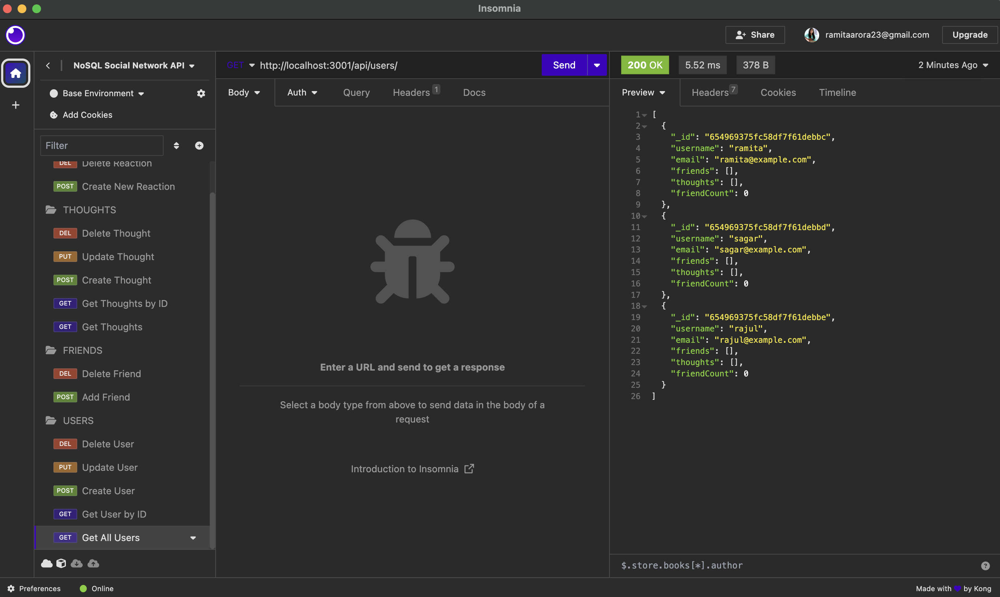

# NoSQL Social Network API

## UCLA Bootcamp Module 18 Challenge

## Description

This project is the API for a social networking site using a NoSQL database. The user can start the server and use Insomnia to:
1. Add users to the database, as well as update their info and delete users
2. View all users and view users by ID
3. Add thoughts associated to users, as well as update the thought and delete the thought
4. Add reactions associated to the thoughts and a user and delete the reactions

## Installation

To install, run `npm install`.

To seed the database, run `npm run seed`.

To start, run `npm start`.

## Usage

The video can be viewed at:

## Credits

This project was created by Ramita Indurkhya.
